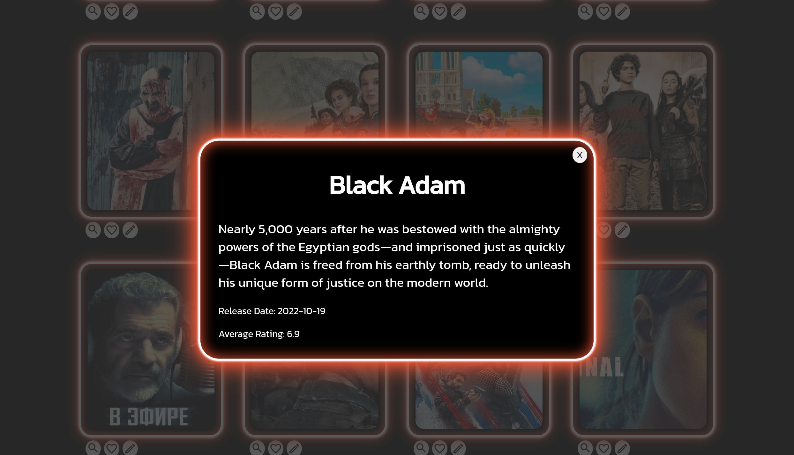
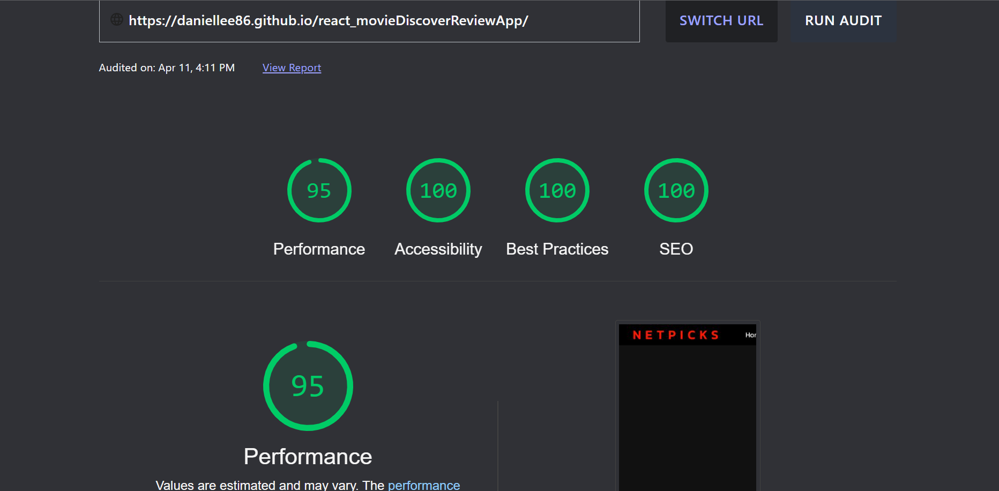

# NETPICKS

---

### View the live project [here.](https://daniellee86.github.io/netpicks/)

The aim for the project was to create an App that consumed data from an API.

---

To do this I made use of The Movie Database API to fetch new movie releases and then filtered movie categories for dynamic rendering and to create a search and discovery experience.

---

Since beggining I have continued to add multiple pages and more features to this app including;

- Homepage.
- Featured movie component, updates on page refresh.
- Description pop-up modals displaying release date and average IMDB rating.
- live search feature.

The project was built using react Styled-Components and Framer-Motion.

---

   

---

   

---

   

---

   

---

# netpicks
